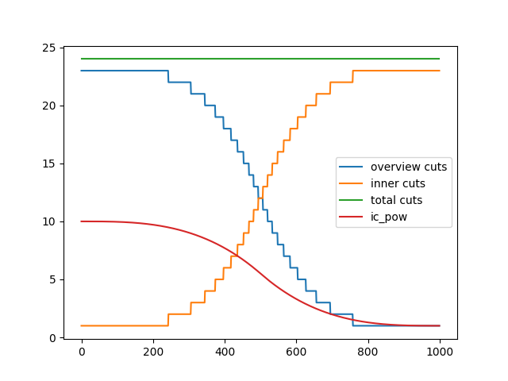

# Cut Schedules

## 00 (Test)

This was my first attempt at designing a cut schedule.

It's not very good.

| Cut Setting   | Value                                                                             |
| :------------ | :-------------------------------------------------------------------------------- |
| cut_easing_fn | CubicEaseInOut                                                                    |
| cut_overview  | `dd_easing_int(start=12, end=0, steps=800, easing_fn=cut_easing_fn)+[0]*200`      |
| cut_innercut  | `dd_easing_int(start=4, end=12, steps=800, easing_fn=cut_easing_fn)+[14]*200`     |
| cut_ic_pow    | `dd_easing_float(start=2, end=10, steps=800, easing_fn=cut_easing_fn)+[12]*200`   |
| cut_icgray_p  | `dd_easing_float(start=0.7, end=0.3, steps=400, easing_fn=cut_easing_fn)+[0]*600` |

## Template

| Cut Setting   | Value |
| :------------ | :---- |
| cut_easing_fn |       |
| cut_overview  |       |
| cut_innercut  |       |
| cut_ic_pow    |       |
| cut_icgray_p  |       |
