# Grayscale Study

In this grayscale study I am interested in exploring the impacts of the setting `cut_icgray_p`. More specifically, I seek to understand if certain art styles, colours, themes etc may benefit greater from deliberate bursts of high-percentage grayscale cuts as opposed to more sustained and gradual scheduling.

Each "version" explores a different approach for scheduling `cut_icgray_p`. A version will contain multiple prompts.

Each prompt will explore subjects of varying complexity and colour in hope of slowing gaining an understanding of when and where grayscale cuts can bring value to an image.

Images are all generated with a standard set of models.

- ViTB32
- RN50
- RN50x4

Unless specified otherwise, these are all performed with the secondary model on a RTX 3070

## Version 1

Version 1 of this study involves setting a "baseline" from a generally accepted "good" cut schedule.

This is very unscientific.

The following was taken from the .TTI example script "Easing Example" distributed with Visions of Chaos for use with Disco Diffusion v5.6.

It was selected due to lack of better option, and its inclusion in the provided examples did undergo at least some level of testing (as seen on their Discord).

```ini
cut_overview=[5]*400+dd_easing_int(start=1, end=5, steps=400, easing_fn=cut_easing_fn)+[0]*200
cut_innercut=[1]*400+dd_easing_int(start=5, end=1, steps=400, easing_fn=cut_easing_fn)+[6]*200
cut_ic_pow=[2]*500+dd_easing_float(start=10, end=1, steps=500, easing_fn=cut_easing_fn)
cut_icgray_p=[0.7]*100+[0.6]*100+[0.45]*100+[0.3]*100+[0]*600
```

### Prompt 1

`0: ["A delicious apple on a wooden bench"]`

| cut_easing_fn        | Plot                                                                                    | Result 1                                                              | Result 2                                                                |
| :------------------- | :-------------------------------------------------------------------------------------- | :-------------------------------------------------------------------- | :---------------------------------------------------------------------- |
| BackEaseInOut        | 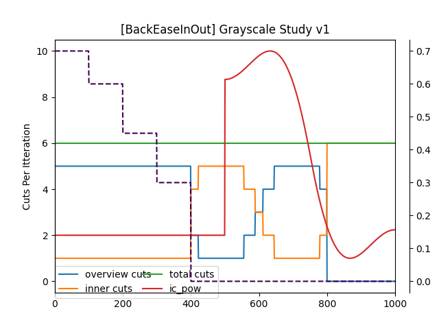               |         |         |
| BounceEaseInOut      | 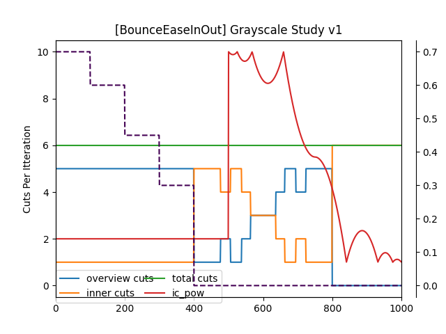           |       |       |
| CircularEaseInOut    | 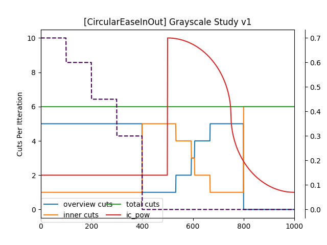       |     |     |
| CubicEaseInOut       | 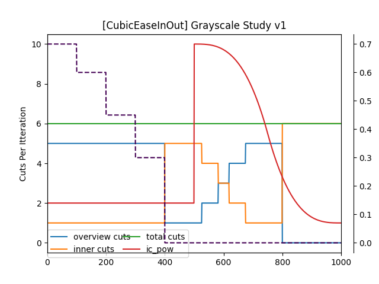             |        |        |
| ElasticEaseInOut     | 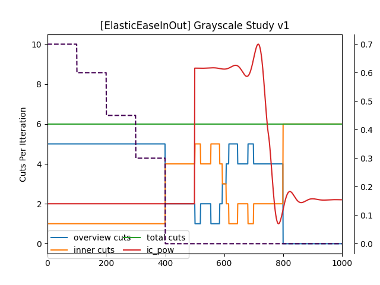         |      |      |
| ExponentialEaseInOut | 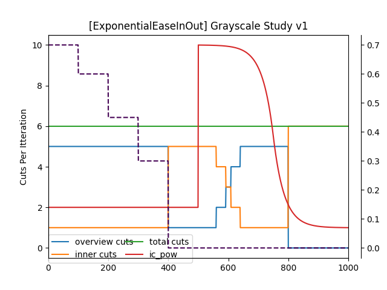 |  |  |
| LinearInOut          | 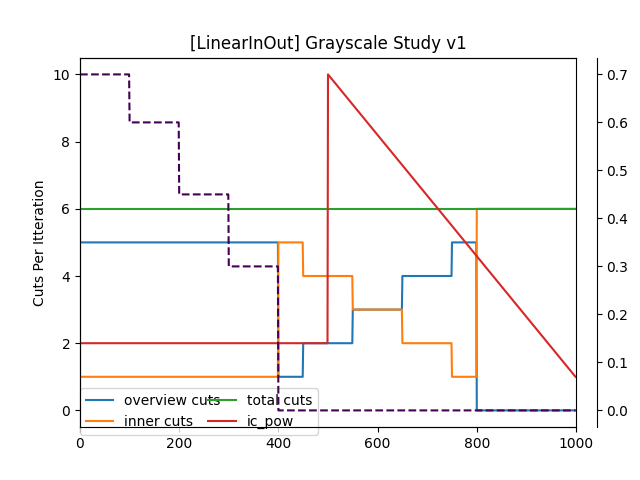                   | 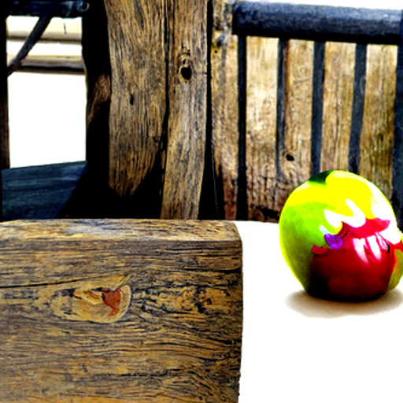          |           |
| QuadEaseInOut        |                |         |         |
| QuarticEaseInOut     | 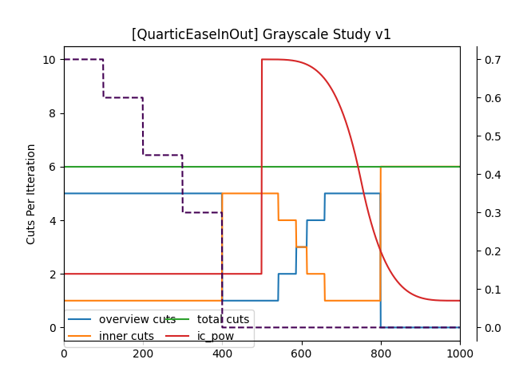         |      |      |
| QuinticEaseInOut     | 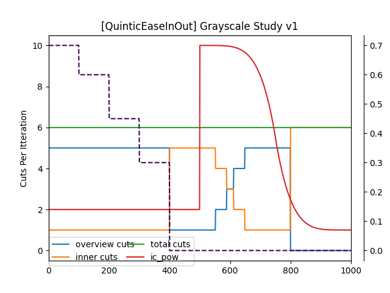         |      |      |
| SineEaseInOut        | 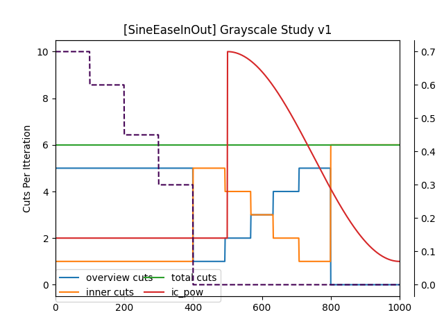               |         | 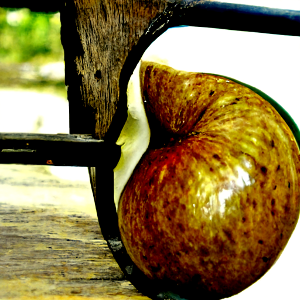        |

### Prompt 2

Using the well-known jina-ai prompt for Disco Diffusion.

Because its so well known, its a good baseline. It's also a prompt that provides more complexity than p1.

```json
  0: [
    "A beautiful painting of a singular lighthouse, shining its light across a tumultuous sea of blood by greg rutkowski and thomas kinkade, Trending on artstation.",
    "yellow color scheme",
  ]
```

| Cut Schedule                                                            | Seed 1                                                                    | Seed 2                                                                    | Seed 3                                                                    |
| :-------------------------------------------------------------------------------------- | :------------------------------------------------------------------------ | :------------------------------------------------------------------------ | :------------------------------------------------------------------------ |
|                | _0.png>)        | _1.png>)        | _2.png>)        |
|            | _0.png>)      | _1.png>)      | _2.png>)      |
|        | _0.png>)    | _1.png>)    | _2.png>)    |
|              | _0.png>)       | _1.png>)       | _2.png>)       |
|          | _0.png>)     | _1.png>)     | _2.png>)     |
|  | _0.png>) | _1.png>) | _2.png>) |
|                    | _0.png>)          | _1.png>)          | _2.png>)          |
|                | _0.png>)        | _1.png>)        | _2.png>)        |
|          | _0.png>)     | _1.png>)     | _2.png>)     |
|          | _0.png>)     | _1.png>)     | _2.png>)     |
|                | _0.png>)        | _1.png>)        | _2.png>)        |
